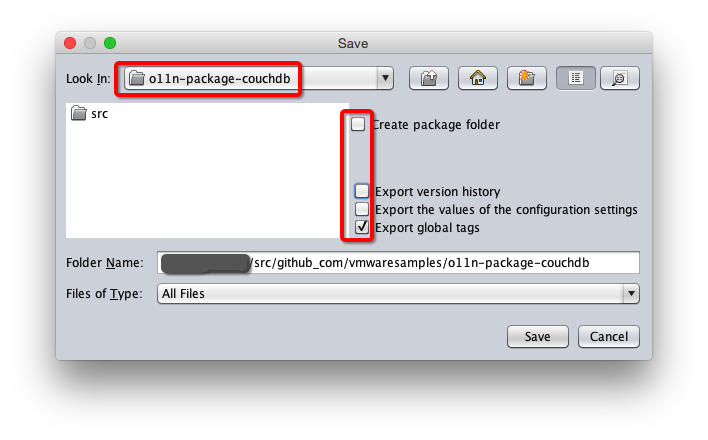

# Contributing to o11n-package-couchdb

The o11n-package-couchdb project team welcomes contributions from the community.

## Contribution Guidelines

Before you start working with o11n-package-couchdb, please read our [Developer Certificate of Origin](https://cla.vmware.com/dco). All contributions to this repository must be signed as described on that page. Your signature certifies that you wrote the patch or have the right to pass it on as an open-source patch.


## Contribution Flow

This is a rough outline of what a contributor's workflow looks like:

- [Fork](https://help.github.com/articles/fork-a-repo/) the main o11n-package-couchdb repository.
- Clone your fork and set the upstream remote to the main o11n-package-couchdb repository.
- Set your name and e-mail in the Git configuration for signing.
- Create a topic branch from where you want to base your work
- Make commits of logical units
- Make sure your commit messages are in the proper format (see below)
- Push your changes to a topic branch in your fork of the repository
- [Submit a pull request](https://help.github.com/articles/about-pull-requests/).

Example:

``` shell
# Clone your forked repository
git clone git@github.com:<github username>/o11n-package-couchdb.git

# Navigate to the directory
cd api-explorer

# Set name and e-mail configuration
git config user.name "John Doe"
git config user.email johndoe@example.com

# Setup the upstream remote
git remote add upstream https://github.com/vmwaresamples/o11n-package-couchdb.git

# Create a topic branch for your changes
git checkout -b my-new-feature master

# After making the desired changes, export the package from vRO (See *Repository Structure* below), commit and push to your fork
git commit -a
git push origin my-new-feature
```

### Staying In Sync With Upstream

When your branch gets out of sync with the vmware/master branch, use the following to update:

``` shell
git checkout my-new-feature
git fetch -a
git pull --rebase upstream master
git push --force-with-lease origin my-new-feature
```

### Updating pull requests

If your PR needs changes based on code review, you'll most likely want to squash these changes into
existing commits.

If your pull request contains a single commit or your changes are related to the most recent commit, you can simply
amend the commit.

``` shell
git add .
git commit --amend
git push --force-with-lease origin my-new-feature
```

If you need to squash changes into an earlier commit, you can use:

``` shell
git add .
git commit --fixup <commit>
git rebase -i --autosquash master
git push --force-with-lease origin my-new-feature
```

Be sure to add a comment to the PR indicating your new changes are ready to review, as GitHub does not generate a
notification when you git push.

### Code Style
We try to follow the best practices outlined in [vRealize Orchestrator Coding Design Guide](http://pubs.vmware.com/orchestrator-70/topic/com.vmware.ICbase/PDF/vrealize_orchestrator_coding_design_guide.pdf)

### Formatting Commit Messages

We follow the conventions on [How to Write a Git Commit Message](http://chris.beams.io/posts/git-commit/).

Be sure to include any related GitHub issue references in the commit message.  See
[GFM syntax](https://guides.github.com/features/mastering-markdown/#GitHub-flavored-markdown) for referencing issues
and commits.

## Reporting Bugs and Creating Issues

When opening a new issue, try to roughly follow the commit message format conventions above.

## Repository Structure
The root of the repository is an vRO Package expanded as a folder without version history.  After making desired changes to the com.vmware.pso.couchdb package in vRO:

* Right click on the package: Choose *Expand Package to Folder...*.
* Export it as a folder with the root of the repository as the target:
