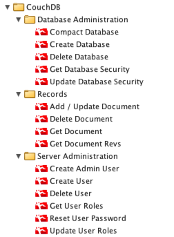

# o11n-package-couchdb

## Overview
This package demonstrates how to use the HTTP-REST plugin in vRealize Orchestrator against the REST API of CouchDB.  Currently the package covers:

* Server User Administration
* Database Administration
* Adding / Fetching /  Updating Documents
* Deleting Documents

## Try it out
Latest stable compiled packages can be found at [releases](https://github.com/vmware/o11n-package-couchdb/releases)

Add it to your Orchestrator as any other package.

Add it with cURL in a shell:

    curl -k -X POST -u <user>:<pass> -F file=@couchdb-<version>.package \
    -F overwrite=true https://<vro.corp.local>:8281/vco/api/packages

### Prerequisites

* vRealize Orchestrator (vRO) 7.0 or greater
* CouchDB 1.6.0 or greater
* A HTTP-REST endping host configured for the CouchDB Server. 

### Build From Source

1. Get access to a /vco-repo from a running vRO VM.  Typical URL is http://*vro.corp.local*:8280/vco-repo.  Note the version of your Orchestrator for use in the build command (Ex: 7.1.0, 7.2.0)
2. mvn clean install -Dvco.version=*7.1.0* -DvcoRepoUrl=http://*vro.corp.local*:8280/vco-repo
3. The compiled package will be in the *target* directory

## Documentation
In Progress

## Contributing

The o11n-package-couchdb project team welcomes contributions from the community.  For more detailed information, refer to [CONTRIBUTING.md](CONTRIBUTING.md).

## License
This package is available under the [2-Clause BSD License](LICENSE.txt)